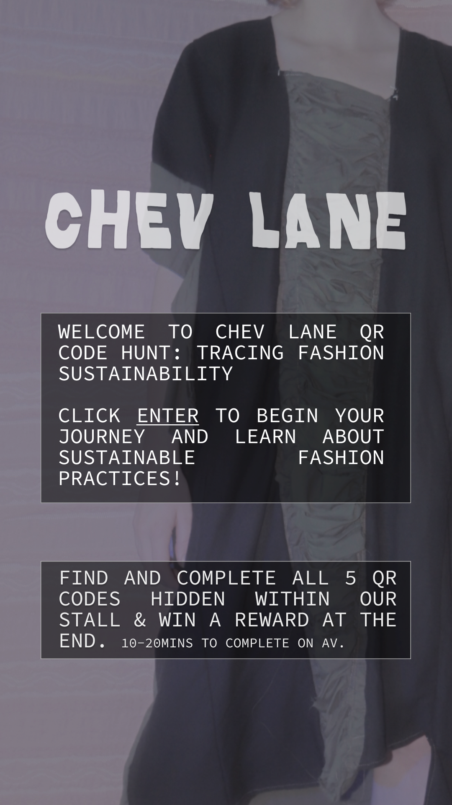
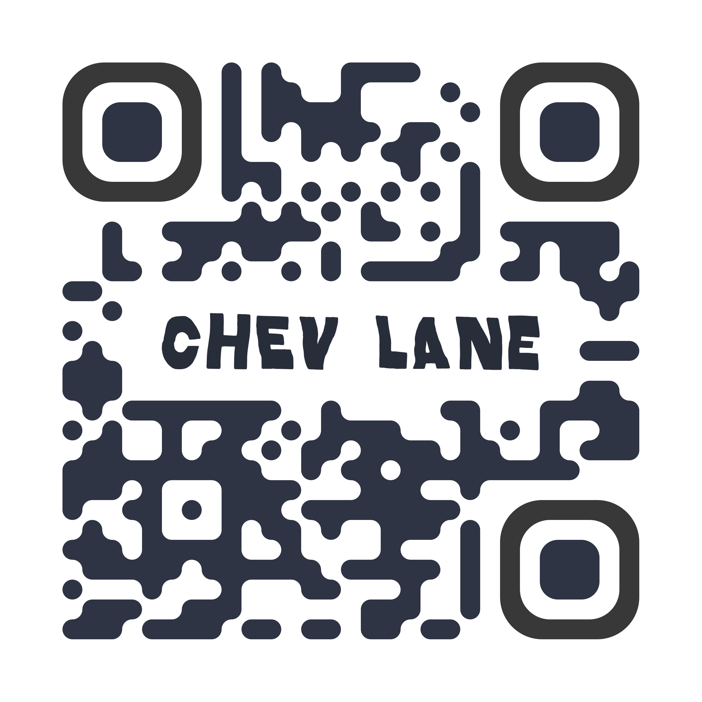
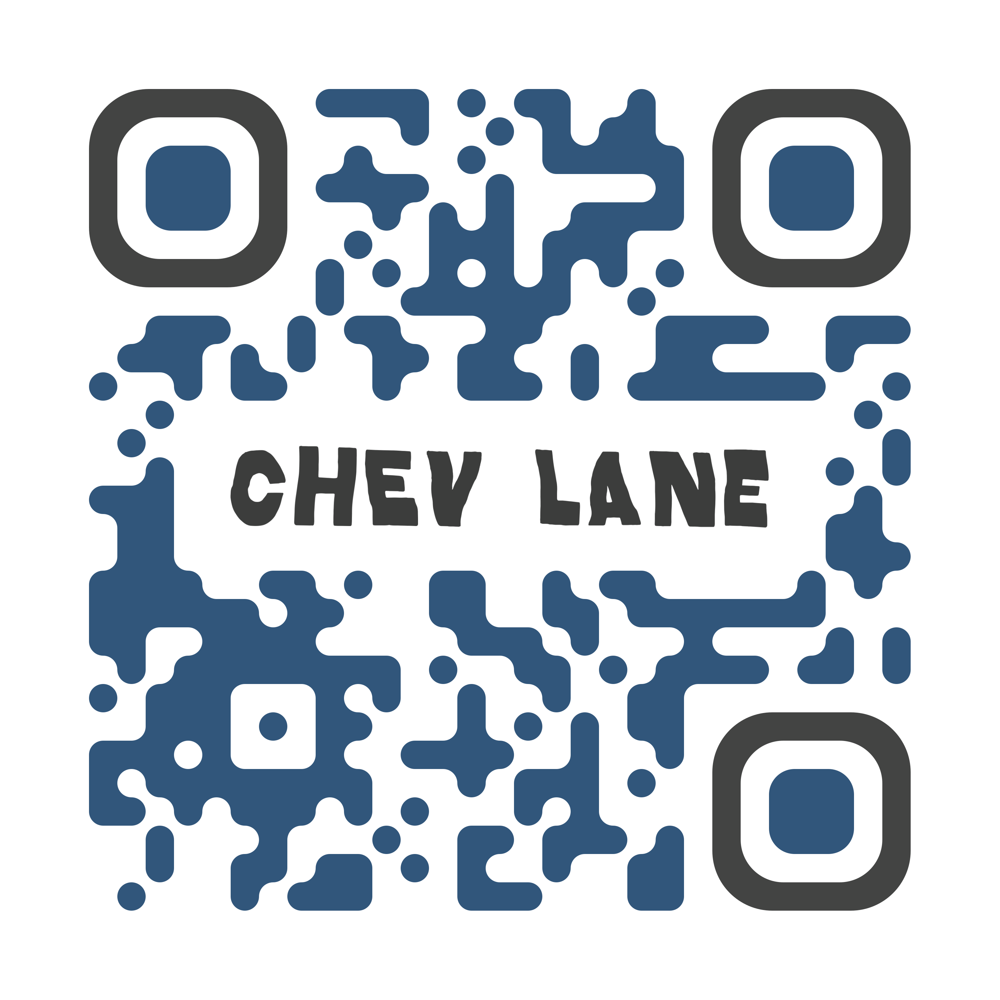
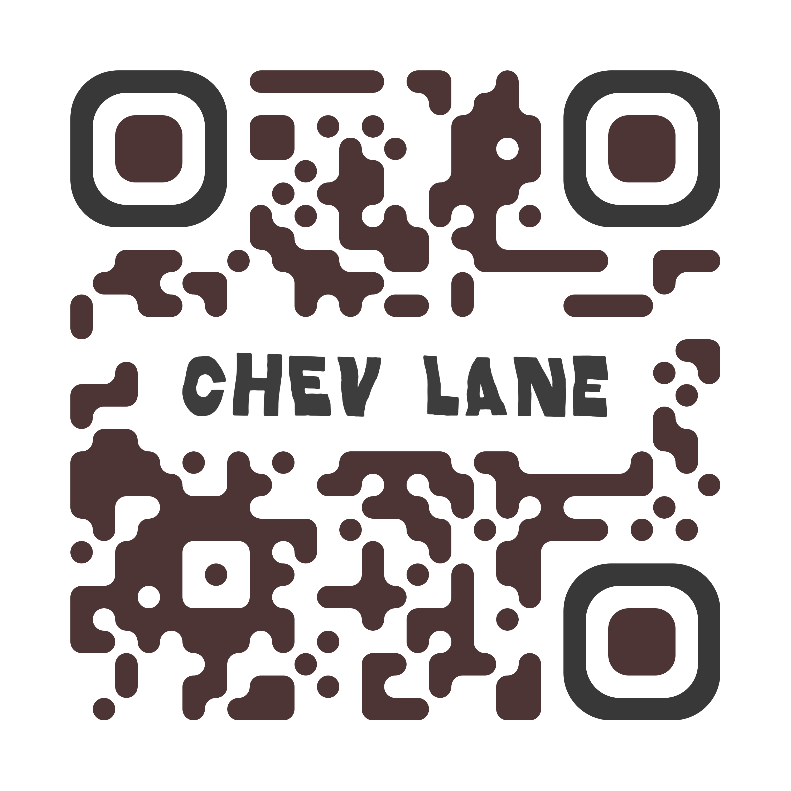
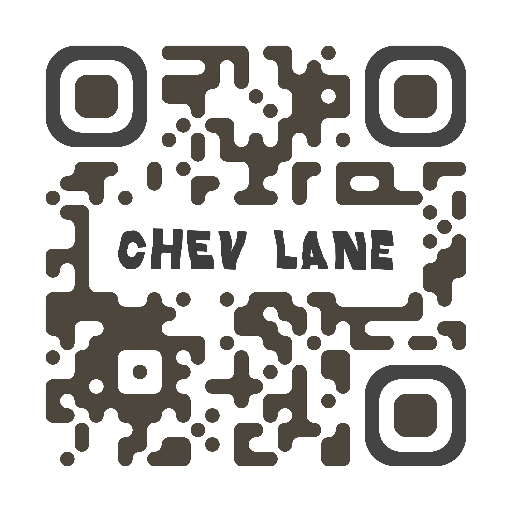
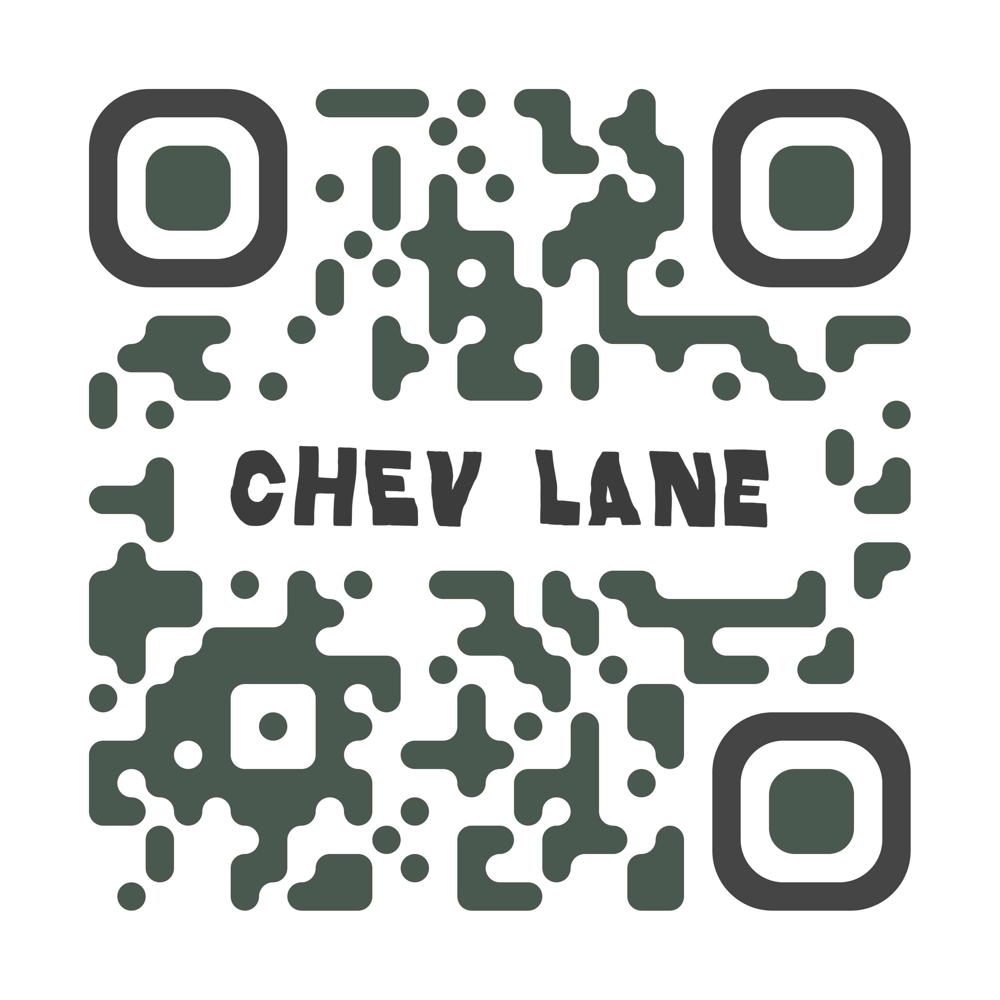
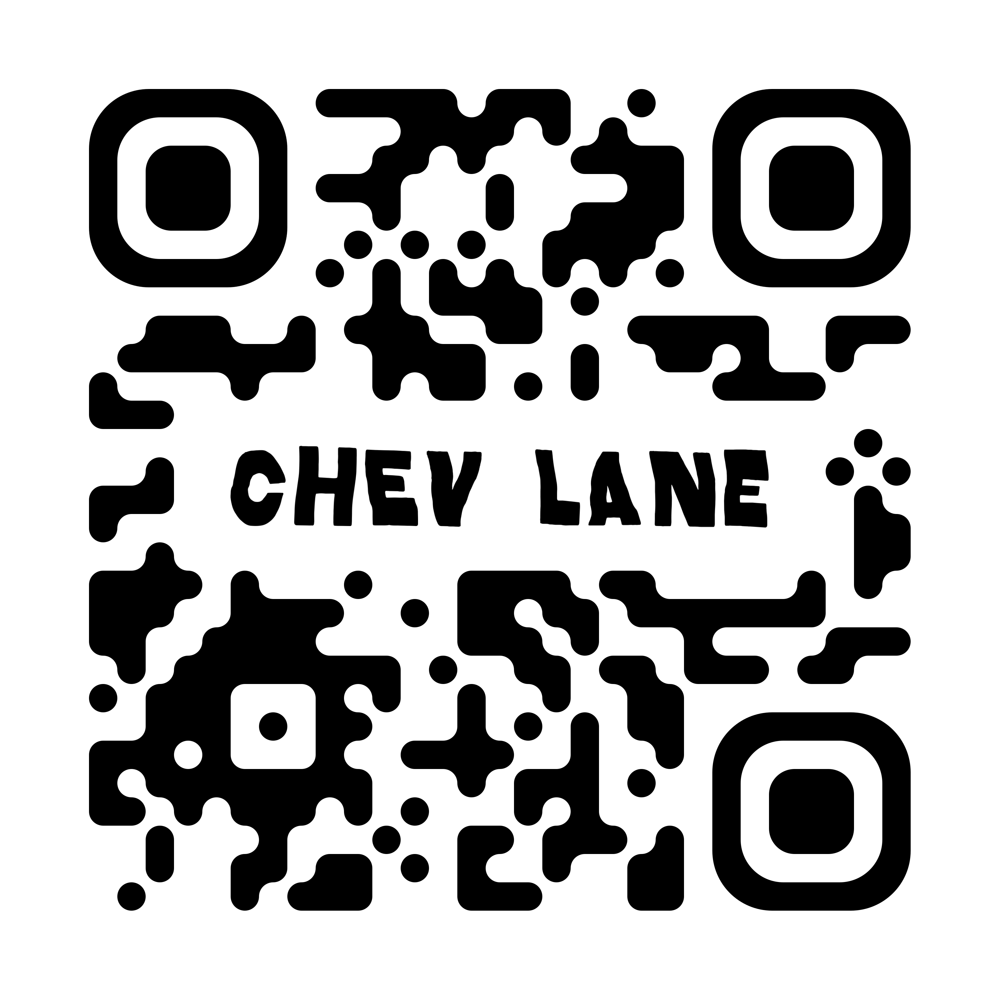

# An interactive and educational app for a local sustainable fashion/ art retailer. Built with React / Typescript / Tailwind CSS.

   

 

## To view web pages, access the QR codes below on mobile.

 

  
  
  
  
  
  
  

